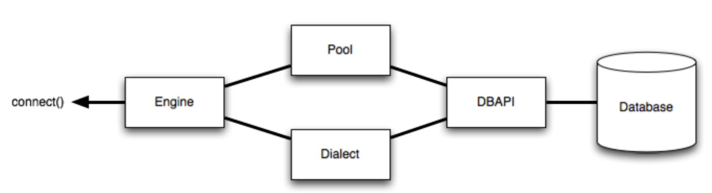

<!-- omit in toc -->
# Introduction
Understand the internal components of sqlalchemy.

<br />

<!-- omit in toc -->
# Table of Contents
- [Fundamental Concepts](#fundamental-concepts)
  - [1. Client](#1-client)
  - [2. Router](#2-router)
  - [3. roll back transactions](#3-roll-back-transactions)
- [Packages](#packages)
  - [1. sqlalchemy](#1-sqlalchemy)
    - [1.1. Connection.execution_options()](#11-connectionexecution_options)
      - [1.1.1. autocommit](#111-autocommit)
  - [2. Structure](#2-structure)
    - [2.1. Dialect](#21-dialect)
    - [2.2. Pool/Connection Pooling](#22-poolconnection-pooling)
- [Commands](#commands)
  - [1. sqlalchemy.engine.base.Engine](#1-sqlalchemyenginebaseengine)
  - [2. sqlalchemy.engine.base.Connection](#2-sqlalchemyenginebaseconnection)
  - [3. Mock sqlalchemy connection failed](#3-mock-sqlalchemy-connection-failed)

<br />

# Fundamental Concepts

## 1. Client
* to communicate between a client application and the database management system

<br />

## 2. Router
* the transmission of data packets from a source to a destination address

<br />

## 3. roll back transactions
* ends the transaction to restore a database to a previous state

<br />

# Packages

## 1. sqlalchemy
* Python SQL toolkit for efficient and high-performing database access
* support ORM (object-relational mapper)

<br />

### 1.1. Connection.execution_options()
* defines the given execution options which will take effect for a call to execute()

<br />

#### 1.1.1. autocommit
> Deprecated since version 1.4
* default = True: issue a commit after an execution
* full control autocommit through Connection.execution_options()
* if autocommit=False,  maintain Transactions state manually by calling session.commit() and session.rollback() 
  > to control transaction boundaries

<br />

## 2. Structure



<br />

### 2.1. Dialect
* Dialect uses a general category of the different patterns of various database servers to define the behavior of a specific database and DB-API combination
  * since different database servers have their patterns

<br />

### 2.2. Pool/Connection Pooling
* to maintain a “pool” of active database connections in memory which are reused across requests

<br />

# [Commands](https://docs.sqlalchemy.org/en/14/)

## 1. sqlalchemy.engine.base.Engine
* the starting point for any SQLAlchemy application
* to provide access to a connection, which can then invoke SQL statements

<br />

## 2. sqlalchemy.engine.base.Connection
* engine provides access to a Connection to invoke SQL statements

  ```python
  from sqlalchemy import text

  with engine.connect() as connection:
      result = connection.execute(text("select username from users"))
      for row in result:
          print("username:", row['username'])
  ```

  * When the connection is closed at the end of the with, the referenced DBAPI connection is **released** to the connection pool. It does not mean the connection is removed, but the pool **stores** the connection for the next use

    * the pooling mechanism will ```rollback()``` the transaction

## 3. Mock sqlalchemy connection failed

  ```python
  conn = engineer.connect()
  conn = conn.invalidate()
  ```

