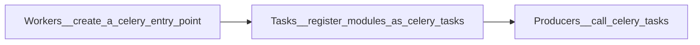

## Celery Flow

### 1. Create an **entry point** of Celery, which is called Celery application/app
        app = Celery('<current_module_name>', include=[''], broker='<message_broker_URL>')

#### current_module_name
* might be the name of the current repository/module
> used to execute Celery worker

    celery -A <current_module_name> worker -l info 

#### include
* path of modules to import, so Celery workers can find tasks
* relative path depends on where to run celery workers by CLI

### 2. Register as a Celery **Task**
    @app.task
    def function():
        ...

### [3. Call **Tasks**](https://docs.celeryq.dev/en/stable/userguide/calling.html#guide-calling)
### apply_scync
* can set set **additional execution options**

        task.apply_async(queue=<queue_name>, args=[arg1, arg2], kwargs={'kwarg1': 'x', 'kwarg2': 'y'})  

### delay
* a more **convenient** way to call task than apply_scync
        
        task.delay(arg1, arg2, kwarg1='x', kwarg2='y')

### signature
* as the parameters of other functions
* used with chain to create a workflow
* use ".s", means that the result or return value of the front task will be pass to the next one

        res = chain(add.s(2, 2), add.s(4), add.s(8))
        res().get()
        >> 16

#### opposite signature: immutable signature
* every task is independent
* .si = .signature(..., immutable=True)
  
        res = chain(add.si(2, 2)|add.si(4, 4)|add.si(8, 8))()
        res.get()
        >>16
        res.parent.get()
        >>8
        res.parent.parent.get()
        >>4

# Reference

https://stackoverflow.com/questions/10260925/how-to-set-up-celery-workers-on-separate-machines