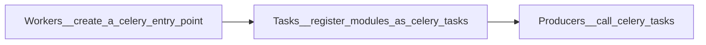

<!-- omit in toc -->
# Introduction
How to apply Celery in distributed computing?

<br />

<!-- omit in toc -->
# Table of Contents
- [Fundamental Concepts](#fundamental-concepts)
  - [1. Celery Flow](#1-celery-flow)
- [Commands](#commands)
  - [1. Create an **entry point** of Celery, which is called Celery application/app](#1-create-an-entry-point-of-celery-which-is-called-celery-applicationapp)
  - [2. Register as a Celery **Task**](#2-register-as-a-celery-task)
  - [3. Call **Tasks**](#3-call-tasks)
    - [3.1. apply_scync](#31-apply_scync)
    - [3.2. delay](#32-delay)
    - [3.3. signature](#33-signature)
      - [3.3.1. opposite signature: immutable signature](#331-opposite-signature-immutable-signature)
- [Reference](#reference)

<br />

# Fundamental Concepts

## 1. Celery Flow


<br />

# Commands 

## 1. Create an **entry point** of Celery, which is called Celery application/app

  ```python
  app = Celery('<current_module_name>', include=[''], broker='<message_broker_URL>')
  ```

* current_module_name
  * might be the name of the current repository/module
  > used to execute Celery worker

  ```sh
  celery -A <current_module_name> worker -l info 
  ```

* include
  * path of modules to import, so Celery workers can find tasks
  * relative path depends on where to run celery workers by CLI


## 2. Register as a Celery **Task**
  ```python
  @app.task
  def function():
      ...
  ```

## 3. [Call **Tasks**](https://docs.celeryq.dev/en/stable/userguide/calling.html#guide-calling)

### 3.1. apply_scync
* can set set **additional execution options**

  ```python
  task.apply_async(queue=<queue_name>, args=[arg1, arg2], kwargs={'kwarg1': 'x', 'kwarg2': 'y'})  
  ```

### 3.2. delay
* a more **convenient** way to call task than apply_scync
        
  ```python
  task.delay(arg1, arg2, kwarg1='x', kwarg2='y')
  ```


### 3.3. signature
* as the parameters of other functions
* used with chain to create a workflow
* use ".s", means that the result or return value of the front task will be pass to the next one

  ```python
  res = chain(add.s(2, 2), add.s(4), add.s(8))
  res().get()
  #>> 16
  ```


#### 3.3.1. opposite signature: immutable signature
* every task is independent
* .si = .signature(..., immutable=True)
  
  ```python
  res = chain(add.si(2, 2)|add.si(4, 4)|add.si(8, 8))()
  res.get()
  #>>16
  res.parent.get()
  #>>8
  res.parent.parent.get()
  #>>4
  ```


# Reference

https://stackoverflow.com/questions/10260925/how-to-set-up-celery-workers-on-separate-machines