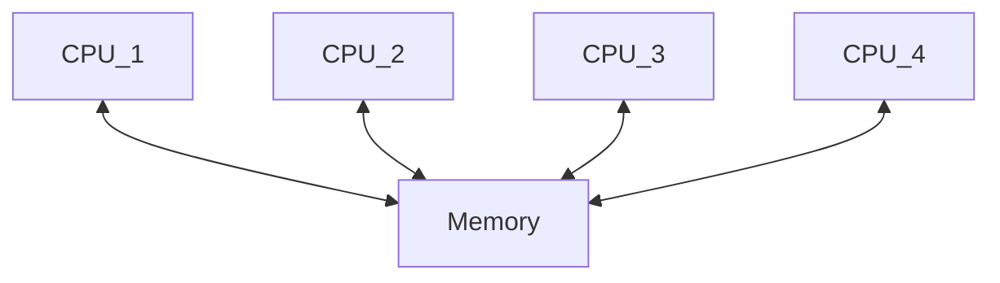
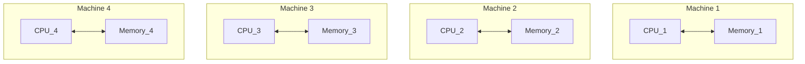

<!-- omit in toc -->
# Table of Contents
- [Introduction](#introduction)
- [Fundamental Concepts](#fundamental-concepts)
  - [1. Networks](#1-networks)
  - [2. asynchronously](#2-asynchronously)
  - [3. synchronously](#3-synchronously)
- [What is Parallel Computing?](#what-is-parallel-computing)
  - [1. Parallel Applications](#1-parallel-applications)
    - [1.1. Multithread Programming](#11-multithread-programming)
    - [1.2. Multiprocessing](#12-multiprocessing)
  - [2. Advantages of Parallel Computing](#2-advantages-of-parallel-computing)
  - [3. Disadvantages of Parallel Computing](#3-disadvantages-of-parallel-computing)
- [What is Distributed Computing?](#what-is-distributed-computing)
  - [1. Advantages of Distributed Computing](#1-advantages-of-distributed-computing)
  - [2. The Biggest Challenge of Distributed Computing](#2-the-biggest-challenge-of-distributed-computing)
- [Differences Between Parallel and Distributed Computing](#differences-between-parallel-and-distributed-computing)
- [Amdahl's law](#amdahls-law)
- [Structure of this directory](#structure-of-this-directory)
 

# Introduction
This README.md introduces the fundamental concepts of distributed computing.

This directory takes references from [Distributed Computing with Python: Harness the power of multiple computers using Python through this fast-paced informative guide](https://www.amazon.com/Distributed-Computing-Python-Francesco-Pierfederici/dp/1785889699)

 

# Fundamental Concepts

## 1. Networks
* Local Area Network (LAN): networks machines are located in the same office/building
* Wide Area Networking (WAN): networks machines are located across different buildings and cities.
* Graphics Processing Unit (GPU)

 

## 2. asynchronously 
no need to wait for a task to be done. Instead, you can do other things while waiting for the task to be done.

 

## 3. synchronously 
need to wait for a task to be finished and then you can do other things 

 

# What is Parallel Computing?
* the simultaneous use of more than one processor on the same machine.

 

## 1. Parallel Applications

### 1.1. Multithread Programming
* **Threads** are the typical tools used in parallel techniques, however, they have some limitations
* an example of shared-memory architecture
  
 

### 1.2. Multiprocessing
* an example of distributed memory architecture

 

## 2. Advantages of Parallel Computing
1. Improve Performance: break up a task into small parts and execute the small parts in the same amount of time, which enables to speed up the execution time of the task
2. Provide responsive interfaces
    * updating the conditions of the thread requires another task
    * Parallel computing has a main thread and worker thread. A main thread can distribute heavy tasks to the worker thread and has enough resources to update its condition to the GUI.
3. in shared-memory systems, the execution time of tasks is faster than using networks to communicate
4. in shared-memory systems, writing codes are simpler

 

## 3. Disadvantages of Parallel Computing
1. in shared-memory systems, multiple treads at the same time may lead to any changes in an unexpected order

 

# What is Distributed Computing?
* the simultaneous use of more than one machine.

 

## 1. Advantages of Distributed Computing
1. enable to solve problems that no individual can handle
2. enable to solve problems that are not solved in a reasonable amount of time
3. distributed memory systems are salable and cheap to assemble
4. access memory in isolation without racing conditions

 

## 2. The Biggest Challenge of Distributed Computing
* Not about CPU, but **data** - how to share data across different machines? 

 

# Differences Between Parallel and Distributed Computing
1. in principle, whether tasks can access the same memory space
2. Parallel Computing
3. in distributed memory systems, sharing data across machines is a challenge
4. not all algorithms easily map to the architecture 

* Distributed Computing
    * across the same network

* in reality, computers are a hybrid of parallel and distributed computing

 

# Amdahl's law
* code can not be faster than the speed of combined sequential parts of a single process
> a single process = sequential part + parallelized part
  * because the sequential part is required: copy data or code across different processors

* even if tasks are fully parallelized, there are diminishing returns in the speed of execution time as the number of processors increases
* Gustafson's law

 

# Structure of this directory
* Celery