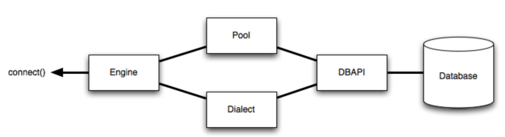

<!-- omit in toc -->
# Introduction
Take note of database


<br />

<!-- omit in toc -->
# Table of Contents
- [Fundamental Concepts](#fundamental-concepts)
  - [Client](#client)
  - [Router](#router)
  - [roll back transactions](#roll-back-transactions)
- [Packages](#packages)
  - [sqlalchemy](#sqlalchemy)
  - [Structure](#structure)
    - [Dialect](#dialect)
    - [Pool/Connection Pooling](#poolconnection-pooling)
- [Commands](#commands)
  - [sqlalchemy.engine.base.Engine](#sqlalchemyenginebaseengine)
  - [sqlalchemy.engine.base.Connection](#sqlalchemyenginebaseconnection)

<br />

# Fundamental Concepts
## Client
* to communicate between a client application and the database management system

## Router
* the transmission of data packets from a source to a destination address

## roll back transactions
* ends the transaction to restore a database to a previous state

<br />

# Packages
## sqlalchemy
* Python SQL toolkit for efficient and high-performing database access
* support ORM (object-relational mapper)

<br />

## Structure



### Dialect
* Dialect uses a general category of the different patterns of various database servers to define the behavior of a specific database and DB-API combination
  * since different database servers have their patterns

### Pool/Connection Pooling
* to maintain a “pool” of active database connections in memory which are reused across requests

<br />

# [Commands](https://docs.sqlalchemy.org/en/14/)

## sqlalchemy.engine.base.Engine
* the starting point for any SQLAlchemy application
* to provide access to a connection, which can then invoke SQL statements

## sqlalchemy.engine.base.Connection
* engine provides access to a Connection to invoke SQL statements

        from sqlalchemy import text

        with engine.connect() as connection:
            result = connection.execute(text("select username from users"))
            for row in result:
                print("username:", row['username'])

    * When the connection is closed at the end of the with, the referenced DBAPI connection is **released** to the connection pool. It does not mean the connection is removed, but the pool **stores** the connection for the next use
  
      * the pooling mechanism will ```rollback()``` the transaction
